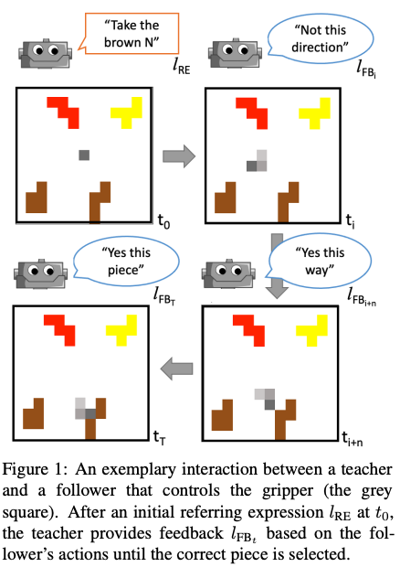
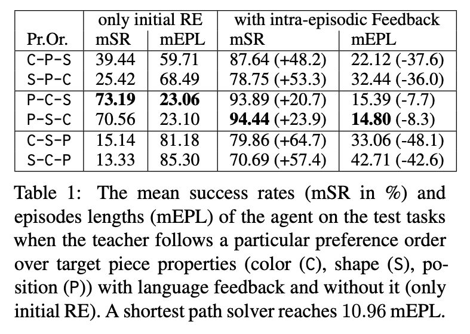

# Yes, this Way! Learning to Ground Referring Expressions into Actions with Intra-episodic Feedback from Supportive Teachers

We present a **Co**llaborative **G**ame of **R**eferential and **I**nteractive language with **P**entomino pieces
(**CoGRIP**) as a controllable setting. A teacher instructs a follower to select a specific piece using a gripper.
Both are constrained as follows: The teacher can provide utterances but cannot move the gripper.
The follower can move the gripper but is not allowed to provide an utterance.
This asymmetry in knowledge and skill forces them to work together and coordinate.

We frame this task as a reinforcement learning problem with sparse rewards and learn a follower policy for a heuristic
teacher. Our results show that intra-episodic feedback allows the follower to generalize on aspects of scene complexity
and performs better than providing only the initial statement.

<p align="center">

</p>

## Abstract

> The ability to pick up on language signals in an ongoing interaction is crucial for future machine learning models
> to collaborate and interact with humans naturally. In this paper, we present an initial study that evaluates
> intra-episodic feedback given in a collaborative setting. We use a referential language game as a controllable
> example of a task-oriented collaborative joint activity. A teacher utters a referring expression generated by
> a well-known symbolic algorithm (the “Incremental Algorithm”) as an initial instruction and then monitors the
> follower’s actions to possibly intervene with intra-episodic feedback
> (which does not explicitly have to be requested).
> We frame this task as a reinforcement learning problem with sparse rewards and learn a follower policy for a
> heuristic teacher. Our results show that intra-episodic feedback allows the follower to generalize on aspects
> of scene complexity and performs better than providing only the initial statement.
>

## Results

<p align="center">

</p>

## Cite

```
@inproceedings{sadler-2023-intra-episodic-feedback,
    title = "Yes, this Way! Learning to Ground Referring Expressions into Actions with Intra-episodic Feedback from Supportive Teachers",
    author = "Sadler, Philipp, Hakimov, Sherzod and Schlangen, David",
    booktitle = "Findings of the Association for Computational Linguistics: ACL 2023",
    month = "july",
    year = "2023",
    address = "Toronto, Canada",
    publisher = "Association for Computational Linguistics",
}
```

# Reproduction

This section covers a step-by-step guide of how to use the provided scripts and sources.

## Preparation

Checkout the repository

Install the requirements:

```
pip install -r requirements.txt
```

Install the font (if on Ubuntu):

```
sudo ./install_font.sh
```

For all commands we assume that you are in the top level project directory and executed in before:

```
source prepare_path.sh
```

## Data Generation

Selection of pieces is stored to `splits.json`. A new one can be generated with

```
python3 scripts/generate_splits.py
```

Tasks are stored to `tasks.json`.

New tasks can be generated with

```
python3 scripts/generate_tasks.py
```

## Data format: Tasks

This file contains the tasks for all splits as a dictionary.

```
{
 "train": [Task],
 "val": [Task],
 "test": [Task],
 "holdout": [Task],
}
```

## Data format: Task

```
{
 "grid_config": {"width": 20, "height": 20, "move_step": 1, "prevent_overlap": true}, 
 "max_steps": 100, 
 "target_piece": {
    "piece_symbol": ["brown", "Y", "top center", 270], 
    "piece_obj": {
        "id_n": 0, 
        "type": "Y", 
        "x": 7, 
        "y": 1, 
        "rotation": 270, 
        "color": ["brown", "#8b4513", [139, 69, 19]], 
        "block_matrix": [[0, 0, 0, 0, 0], [0, 0, 1, 0, 0], [0, 0, 1, 1, 0], [0, 0, 1, 0, 0], [0, 0, 1, 0, 0]]
    }
 }, 
 "pieces": [
    {"piece_symbol": ["brown", "Y", "top center", 270], "piece_obj": {<as above>}},
    {...},
    ... 
  ]
}
```

## Training

The models will be saved to `save_models` in the project folder.

The data mode `sequential_generation` is assumed (should not be changed)

### With Intra-Episodic Feedback

```
python3 scripts/follower_train.py large CSP
```

### Without Feedback

```
python3 scripts/follower_train.py large CSP --no_feedback
```

## Evaluation

The evaluation is similar (but you choose the split)

```
python3 scripts/follower_eval.py val 20 [--no_feedback]
```

You can evaluate only for a specific amount of pieces

```
python3 scripts/follower_eval.py val 20 --num_pieces 8
```

## Compute the results

The results should be put into the following structure under the project root

```
results/
    |- PentoEnv/
        |- CPS/
        |    |- fb/v1/mifb/pixels-we+lm-film/128-128-128/1024@8/
        |        |- holdout.monitor.csv
        |        |- only_mission.monitor.csv
        |        |- only_piece_feedback.monitor.csv
        |        |- text.monitor.csv
        |        |- val.monitor.csv
        |- CSP/ 
        ...
```

For Table 1

```
python3 scripts/results_table_1.py
```

For Table 2

```
python3 scripts/results_table_2.py
```

For Table 3

```
python3 scripts/results_table_3.py
```